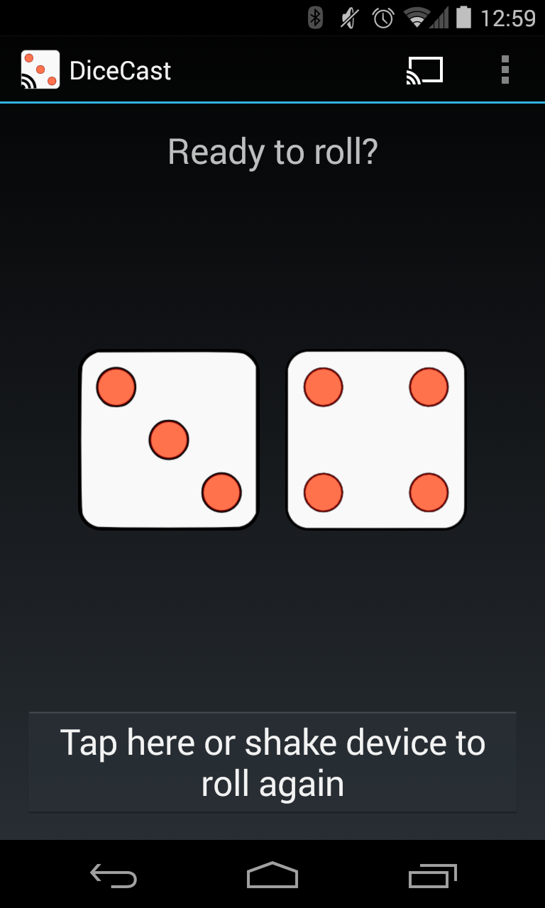

DiceCast
========
A "Google Cast™ Ready" dice roller for Android. 

### About
DiceCast demonstrates how to use the Cast API for non-media based application development. It is a basic sender
application that communicates with the receiver application using a custom channel. It was developed
before the ability to cast your Android screen was available.

### CastCompanionLibrary
This project uses the [CastCompanionLibrary](https://github.com/googlecast/CastCompanionLibrary-android),
a wrapper around the Cast SDK that reduces the amount of boilerplate code needed by an 
application to provide basic casting.
 
Have a look at some basic cast examples that do not use CCL:

* The sample application [CastHelloText-android](https://github.com/googlecast/CastHelloText-android.git)
* The DiceCast MainActivity prior to integrating CCL [v1.0.0](https://github.com/bdiegel/DiceCast-android/blob/v1.0.0/app/src/main/java/com/honu/dicecast/MainActivity.java) 

### Project Setup
This is an Android Studio project. The gradle build has an **external** dependency on the Android 
library project [CastCompanionLibrary](https://github.com/googlecast/CastCompanionLibrary-android).
See settings.gradle and build.gradle for details of how this dependency is configured.

The structure of the working directory:

  1. create a directory that will hold both projects and cd into it
  2. git clone [https://github.com/bdiegel/DiceCast-android.git]()
  3. git clone [https://github.com/googlecast/CastCompanionLibrary-android]() CastCompanionLibrary   
   **OR**   
   git clone [https://github.com/bdiegel/CastCompanionLibrary-android.git]() CastCompanionLibrary

My fork of CCL uses an updated GMS Play Services SDK and Support Library, providing updated Cast icons.  

### Acknowledgments
* The [CastCompanionLibrary](https://github.com/googlecast/CastCompanionLibrary-android) is provided by [googlecast](https://github.com/googlecast) 
* DiceCast artwork was provided by [Dino Morelli](https://github.com/dino-)
* [DiceShaker](https://github.com/bdiegel/DiceCast-android/blob/master/app/src/main/java/com/honu/dicecast/DiceShaker.java) 
is a modified accelerometer listener implementation from a [tutorial](http://teamtreehouse.com/library/build-a-simple-android-app/shaking-things-up/adding-a-shake-detector) 
by [Ben Jakuben](http://teamtreehouse.com/bendog24). 

### Other
Google Cast Ready and the Google Cast Ready Badge are trademarks of Google Inc